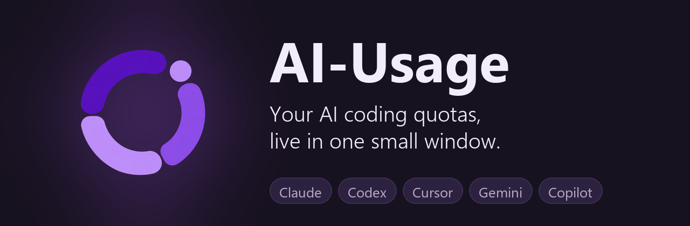
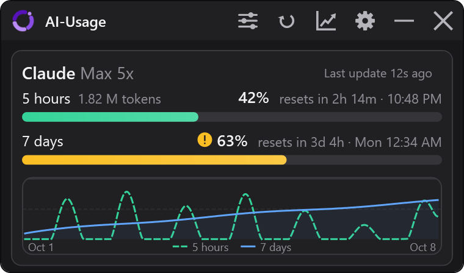
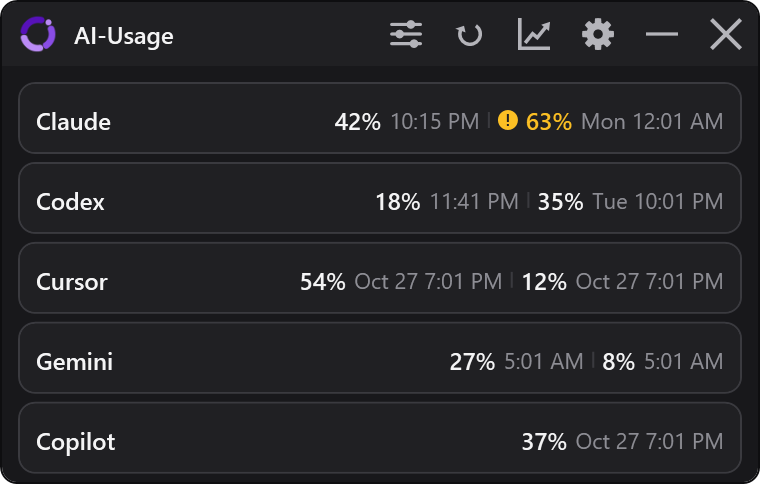
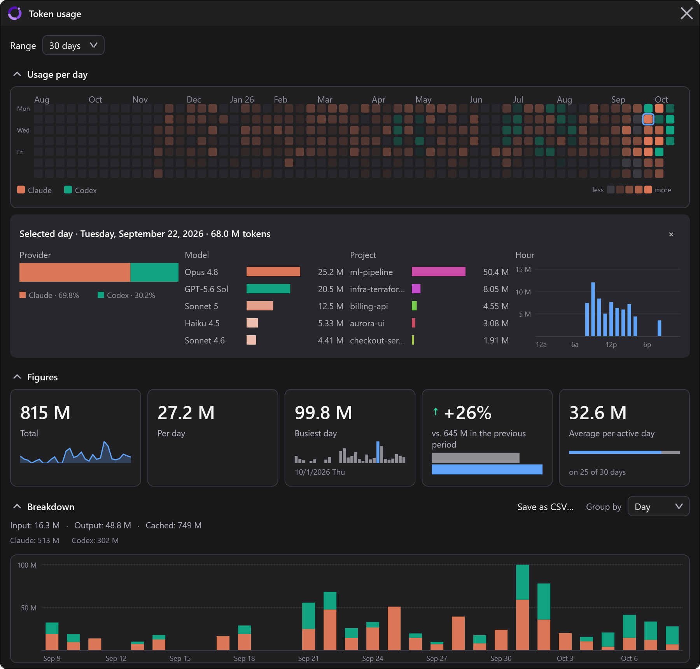

<div align="center">

<h1></h1>

Claude, Codex, Cursor, Gemini and Copilot side by side, with a countdown to every reset,<br>
so the next "usage limit reached" never catches you mid-flow.

[](../../releases/latest)
[](../../actions/workflows/ci.yml)


[](LICENSE)



</div>

## Why AI-Usage

You are deep in a refactor, the agent is on a roll, and then the limit hits. Which tool still has
room? When does the 5-hour window reset? How close is the weekly cap?

AI-Usage answers all of that at a glance. It sits in a corner of your screen (or just in the tray),
reads the numbers straight from the tools you already use, and turns them into clear bars,
countdowns and history charts. No accounts to create, no API keys to paste, nothing to configure
before the first number shows up.

## Supported agents

<table>
  <tr>
    <th align="left">Agent</th>
    <th align="left">What you see</th>
    <th align="left">Where the numbers come from</th>
  </tr>
  <tr>
    <td><b>Claude</b><br><sub>Claude Code</sub></td>
    <td>5-hour and weekly limits, every extra window the account reports, token statistics</td>
    <td>The sign-in Claude Code already has on this PC and its local session logs; an optional
      browser session for further accounts</td>
  </tr>
  <tr>
    <td><b>OpenAI Codex</b></td>
    <td>5-hour and weekly limits, real token counts, token statistics</td>
    <td>Codex's local session files; a signed-in browser session as a fallback</td>
  </tr>
  <tr>
    <td><b>Cursor</b></td>
    <td>Monthly plan usage, split into Cursor's own models and API models where the plan reports it</td>
    <td>A signed-in browser session</td>
  </tr>
  <tr>
    <td><b>Google Gemini</b><br><sub>Antigravity</sub></td>
    <td>Gemini quota windows with their reset times</td>
    <td>The account the Antigravity CLI (<code>agy</code>) is signed in with; a signed-in browser
      session for the extra figures</td>
  </tr>
  <tr>
    <td><b>GitHub Copilot</b></td>
    <td>Monthly premium requests</td>
    <td>The GitHub CLI (<code>gh</code>) you are already signed in with</td>
  </tr>
</table>

More than one account per agent? Add it, and it gets its own tile and history. Copilot offers every
further account the GitHub CLI is signed in with; the other agents sign in through the built-in
browser.

<div align="center">

<br><sub>Every supported agent at once, small layout</sub>
</div>

## Highlights

**At a glance**
- Every usage window an agent reports, as a bar with its percentage and a plain countdown
  ("resets in 2h 14m"), plus its tokens and a "full in about 3h" forecast when there is room
- A warning sign next to a quota that runs low, so the level never depends on colour alone
- A tray icon that shows the busiest quota, or the one agent and window you pick
- Threshold alerts per agent and window, plus a notice once a window is free again
- History per agent over 24 hours, 7 days, 30 days, a year or everything, kept locally for up to
  ten years
- Error messages that name the cause (no answer in time, HTTP code, no connection) and offer to
  sign in again when a sign-in has expired

**Made for your desktop**
- Tiles below each other or side by side; the window sizes itself and switches between the full
  and the small layout so nothing is cut off
- Always on top, click-through overlay mode and adjustable opacity
- Themes: System (follows Windows light and dark live), Nebula, Terminal, Dark and Light, plus high
  contrast
- Autostart, timed refresh, settings export and import, update check
- Light on your PC: while the screen is locked the widget slows down and catches up once you are
  back; the hidden sign-in browser is released after 15 idle minutes
- Remove an account in one step: its sign-in in AI-Usage goes, and its history too if you tick it
- English and German

## Token usage window

Quotas tell you how much is left. The token usage window shows where it went. It reads the session
logs Claude Code and Codex keep on your PC, builds its own local index and turns them into a
dashboard for any period you pick: 7 days, 30 days, a year or everything.

- **Your history at a glance:** an activity grid with one square per day, colored by the agent that
  led that day. It reaches back as far as the window is wide, at least twelve months. Click a day
  to open its details: agents, models, projects and hours.
- **Key figures:** total tokens, average per day and per active day, the busiest day and the change
  against the previous period.
- **Breakdowns:** input, output and cache tokens, grouped by day, week, model, project or effort
  level, plus the share per agent, model and effort level.
- **Your projects:** the folders that used the most tokens, with their share of the total.
- **Patterns:** usage per day, per weekday or per hour.
- **CSV export** for your own spreadsheets.
- **Your layout:** drag a section by its heading above, below or beside another one, or move it
  with Alt+Up and Alt+Down. The layout is remembered and can be reset.

Cursor, Gemini and Copilot keep no token counts on your PC, so the window says so instead of
showing a guess.

<div align="center">

<br><sub>The token usage window</sub>
</div>

## Private by design

- **Reads usage numbers only.** AI-Usage only calls the usage pages and endpoints each agent
  offers. It never sends a prompt to a model, so reading your quota does not spend any of it. A
  test in the suite checks every endpoint the app can call.
- **Leaves your tools alone.** It never writes to an agent's own files and never copies or stores
  the sign-in of your CLI tools. Browser sign-ins live in AI-Usage's own browser profile per agent.
  Signing out in AI-Usage only disconnects AI-Usage; your CLI and IDE stay signed in.
- **Project colors from your project icons.** To give each project in the token usage window its
  own color, AI-Usage looks inside the project folders named in the session logs for an app icon
  (`.ico` or `.png`, up to six folder levels deep) and takes its main color. It only reads those
  images and keeps nothing but the color.
- **Stays on your machine.** Settings, history and the statistics index live in
  `%APPDATA%\AI-Usage\`. Browser sign-ins get their own profile per agent under
  `%LOCALAPPDATA%\AI-Usage\webview\`. Apart from the requests to each agent's usage pages, the
  Google token refresh for an expired Antigravity CLI sign-in and the update check, nothing leaves
  your computer. No telemetry.

## Get started

1. Download `AI-Usage.exe` (portable) or the installer from the [latest release](../../releases/latest).
2. Run it. Agents you are already signed in to show up on their own.
3. For the rest, open **Settings > Providers** and sign in through the built-in browser.

| File | What it is |
|---|---|
| `AI-Usage.exe` | Portable: one standalone executable for x64, no installation |
| `Setup-AI-Usage-<version>.exe` | Installer for x64 and ARM64, for everyone or just for you, with optional autostart and desktop shortcut |
| `SHA256SUMS.txt` | Checksums for both |
| `*.exe.sig` | Detached signature next to each exe, checked by the in-app update |

What changed in each version is listed in the [changelog](CHANGELOG.md).

### Requirements

- Windows 10 (version 1809, build 17763) or Windows 11, x64 or ARM64
- Nothing to install first: both files are self-contained
- Browser sign-in uses the Microsoft Edge WebView2 runtime, which ships with current Windows;
  without it the app says so and everything else keeps working
- Copilot needs the GitHub CLI (`gh`) signed in; Gemini reads the Antigravity CLI's (`agy`) active
  account

### Updates

When a newer release exists, a notice bar offers to install it. The installed copy runs the new
setup, the portable copy swaps its own exe and restarts. Updating is optional: switch the check
off under **Settings > System** and the app never asks.

Uninstalling keeps your data. Delete the two folders named above to remove it.

## Build from source

Requires the .NET 10 SDK and, for the installer, Inno Setup 6.

```bat
build.bat
```

`build.bat` compiles, runs the test suite, publishes x64 and ARM64 as single-file self-contained
executables, builds the installer and writes everything plus `SHA256SUMS.txt` into `dist\`. When a
signing key is present (`.signing\ai-usage-update.pem`, never committed, or the path in
`AIUSAGE_SIGNING_KEY`) it also signs each exe; without one the build says so and the in-app update
refuses that build.

Contributions are welcome, see [CONTRIBUTING.md](CONTRIBUTING.md). Found a security issue? Please
follow [SECURITY.md](SECURITY.md).

## FAQ

**Another tool shows far more tokens than AI-Usage. Which one is right?**
Claude Code often writes the same response to its log several times. AI-Usage counts each response
once; tools that add up every line count those repeats again, often close to twice the real total.

**An agent shows no numbers.**
Open **Settings > Providers** and sign in there. Copilot needs the GitHub CLI signed in
(`gh auth login`), Gemini reads the account of the Antigravity CLI (`agy`).

**My token history starts later than I expected.**
The token usage window can only read the session logs that still exist. Claude Code deletes its
logs after 30 days by default; raise `cleanupPeriodDays` in its settings to keep more. Whatever
AI-Usage has read once stays in its own index.

## License

[MIT](LICENSE). Third-party components:
[CommunityToolkit.Mvvm](https://github.com/CommunityToolkit/dotnet) (MIT),
[Microsoft.Data.Sqlite](https://github.com/dotnet/efcore) (MIT),
[SQLitePCLRaw](https://github.com/ericsink/SQLitePCL.raw) (Apache 2.0),
Microsoft Edge WebView2 (Microsoft's own redistributable licence).

Claude, Codex, Cursor, Gemini, Antigravity and GitHub Copilot are trademarks of their respective
owners. AI-Usage is an independent project and not affiliated with any of them.

<div align="center"><sub>© 2026 BGCoding</sub></div>
